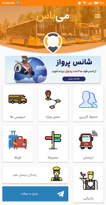
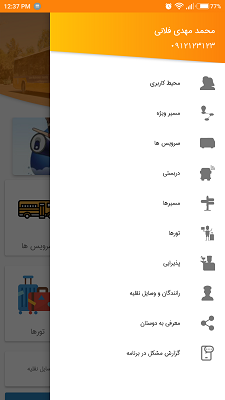
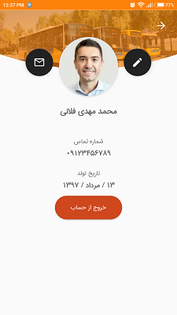
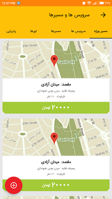
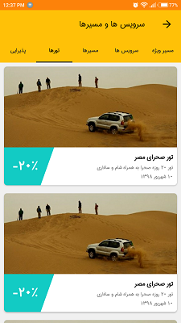

# Mebus

User interface implementing of an Android Application.

* 
* [Get the apk from Appcenter](https://install.appcenter.ms/users/yazdipour/apps/mebus/distribution_groups/public)

## Screenshots

### License

> Unpaid project + No legal documents were signed + I made it on my own device
